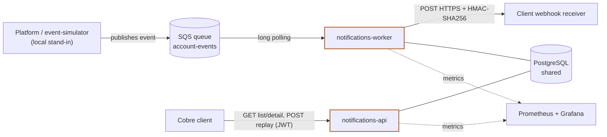
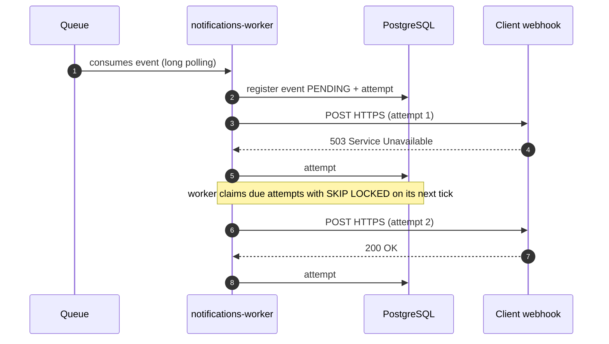

# account-event-notification

Webhook delivery of account events with configurable retries, and a self-service API for clients
to query and replay their own notifications. Built for Cobre clients who need reliable,
observable delivery of account events to their systems. Runs entirely on Docker Compose locally,
with AWS (SQS, RDS Postgres, CloudWatch) as the target production design.

[](https://github.com/ocasti/account-event-notification/actions/workflows/ci.yml)


## Table of contents

- [How it works](#how-it-works)
- [Repository layout](#repository-layout)
- [Getting started](#getting-started)
- [Try it](#try-it)
- [API and contracts](#api-and-contracts)
- [Observability](#observability)
- [Load testing](#load-testing)
- [Quality gates and tests](#quality-gates-and-tests)
- [Design and decisions](#design-and-decisions)
- [Services](#services)

## How it works



In production the platform's own event bus publishes to the queue directly; locally,
`event-simulator` plays that role, replaying a reference dataset and then generating derived
events on an interval. `notifications-worker` and `notifications-api` are the same codebase
running as two Spring profiles of one image, sharing one PostgreSQL database.

A delivery with one retry and a final success:



Every event is registered idempotently by `event_id`: a redelivered queue message with an id
already on file is discarded as a duplicate, never re-registered. Delivery attempts live in their
own table, claimed by the worker with `SELECT ... FOR UPDATE OF d SKIP LOCKED`, so multiple worker
replicas compete for the same due attempts without double-delivering one. Failed attempts retry
with exponential backoff and jitter: base delay 30 s, factor 4, capped at 15 minutes, ±20% jitter,
5 attempts (about 26 minutes to `FAILED`); the local profile compresses this to a 2 s base and a
10 s cap so the same five attempts finish in under a minute. Every outbound POST that has a signing
key configured on the subscription carries an HMAC-SHA256 signature over the timestamp and body. A
notification stuck in `FAILED` can be replayed through the self-service API, which opens a new
delivery cycle without touching the event's original data.

## Repository layout

```
services/
  notifications/            Maven reactor of three modules, produces cobre/notifications
    domain/                 Hexagon core: entities, state machine, retry policy (pure Java)
    application/             Hexagon core: output ports and the five use cases (pure Java)
    infrastructure/          Hexagon adapters: REST, JPA, SQS listener, webhook sender, security
  event-simulator/          Stands in for the event-emitting platform (local only)
deploy/
  local/                    Compose stack: ElasticMQ, WireMock, Prometheus, Grafana, JWT keys
docker/                     Dockerfiles for both images (build context: repository root)
docs/                       RFC, security analysis, AI usage log, reference dataset, docs/api/
scripts/                    preflight.sh, token.sh, load_test.py
.github/                    CI workflow
```

- [`services/notifications`](services/notifications) — [`domain`](services/notifications/domain),
  [`application`](services/notifications/application),
  [`infrastructure`](services/notifications/infrastructure)
- [`services/event-simulator`](services/event-simulator)
- [`deploy/local`](deploy/local)
- [`docker`](docker)
- [`docs`](docs), [`docs/api`](docs/api)
- [`scripts`](scripts)
- [`.github`](.github)

## Getting started

**Requirements.** Docker and the Docker Compose plugin — both services build inside Docker, so no
local Java or Maven installation is required. Java 21 only if developing against the code outside
a container (running a module with `./mvnw`, using an IDE, `make test`).

```bash
make preflight   # checks Docker, free ports and memory; creates .env from .env.example
make keys        # generates the RS256 key pair used to sign demo JWTs into deploy/local/keys/
make up          # builds and starts postgres, elasticmq, wiremock, api, worker, simulator
```

| Container | What it is for | Published port |
|---|---|---|
| `postgres` | Single source of truth: `notification_events`, `delivery_attempts`, `subscriptions` | `${POSTGRES_PORT:-5432}` |
| `elasticmq` | Queue with the SQS API; publishes the statistics UI used by the healthcheck | `${ELASTICMQ_UI_PORT:-9325}` |
| `wiremock` | Webhook receiver for the demo: 200 by default, 503 for `EVT003`/`EVT005`/`EVT009` | `${WIREMOCK_PORT:-8089}` |
| `notifications-api` | Self-service REST API (list, detail, replay), JWT-protected; runs the Flyway migrations | `${API_PORT:-8080}` |
| `notifications-worker` | Consumes the queue, claims due delivery attempts, delivers webhooks with retries | none (scale with `--scale notifications-worker=N`) |
| `event-simulator` | Stands in for the platform: replays the reference dataset and keeps emitting derived events | `${SIMULATOR_PORT:-8090}` |

`make up-all` adds `postgres-exporter`, `node-exporter`, `prometheus` (`${PROMETHEUS_PORT:-9090}`)
and `grafana` (`${GRAFANA_PORT:-3001}`) for observability — see
[Observability](#observability). Stop everything with `make down`.

Both services use Testcontainers for their integration tests, which needs a Docker socket that
OrbStack does not expose at the default path — see
[Quality gates and tests](#quality-gates-and-tests) for the one-time setup.

## Try it

Issue a JWT for a client (20-minute lifetime, RS256, `sub` claim carries the client id):

```bash
make token CLIENT=CLIENT002
```

List that client's notifications, filtering by `delivery_status`, a date range and paging by
cursor:

```bash
TOKEN=$(make token CLIENT=CLIENT002)
curl -sS "http://localhost:8080/notification_events?delivery_status=failed&from=2024-03-15T00:00:00Z&to=2024-03-16T00:00:00Z&limit=20" \
  -H "Authorization: Bearer $TOKEN"
```

Get the detail of one event, including its delivery attempts:

```bash
curl -sS "http://localhost:8080/notification_events/EVT005" -H "Authorization: Bearer $TOKEN"
```

Replay a failed notification (opens a new delivery cycle, picked up by the worker on its next
tick):

```bash
make replay ID=EVT005 CLIENT=CLIENT002   # 202 Accepted if delivery_status was failed
make replay ID=EVT005 CLIENT=CLIENT002   # 409 Conflict on the second call: no longer failed
```

The reference dataset the simulator replays on startup has 10 events: 7 end `completed`, 3
(`EVT003`, `EVT005`, `EVT009`) end `failed` because WireMock is mapped to answer those with 503,
exercising the retry and `FAILED` path deterministically.

## API and contracts

- [`docs/api/openapi.json`](docs/api/openapi.json) — the self-service REST API (list, detail,
  replay); browse it live at Swagger UI (`make up`, profile `local`, `http://localhost:8080/swagger-ui/index.html`).
- [`docs/api/asyncapi.yaml`](docs/api/asyncapi.yaml) — the `account-events` queue: the message the
  worker consumes, and its dead-letter queue.
- [`docs/api/webhook-contract.md`](docs/api/webhook-contract.md) — the outbound webhook the worker
  sends to each client's receiver: headers, HMAC signature, retries, replay.
- [`docs/api/README.md`](docs/api/README.md) — how to view each contract without running the
  stack.

## Observability

Prometheus and Grafana ship in the `observability` profile, with two provisioned dashboards
(`Notifications`, four panels: delivery rate by status, webhook p95 by client, attempts due,
failures by client; `Notifications · Service review`, nine rows covering Postgres load,
deliveries, ingestion, errors, the HTTP API, the JVM and host resources), 12 Prometheus alerting
rules, and `postgres-exporter` / `node-exporter` for database and host-level metrics. See
[`deploy/local/README.md#what-to-look-at-in-grafana`](deploy/local/README.md#what-to-look-at-in-grafana)
and [`deploy/local/README.md#alarms-deploylocalprometheusalertsyml`](deploy/local/README.md#alarms-deploylocalprometheusalertsyml).

## Load testing

```bash
make load   # EVENTS=2000 FAIL_RATIO=0.10 CONCURRENCY=8 TIMEOUT=300 API_RPS=20 API_CLIENTS=4 by default
```

Publishes events straight onto the queue, drains the backlog, and checks nothing was lost or
double-delivered, while a second phase load-tests the REST API. Reference results:
[`deploy/local/README.md#load-test`](deploy/local/README.md#load-test).

## Quality gates and tests

```bash
make test   # ./mvnw verify in services/notifications and services/event-simulator
```

| Module | Tests |
|---|---|
| `services/notifications/domain` | 118 |
| `services/notifications/application` | 25 |
| `services/notifications/infrastructure` | 220 |
| `services/event-simulator` | 24 |

`verify` also runs, locally and in CI:

- **PMD** (`pmd-ruleset.xml` in each service): fails the build on unused imports or private
  members, empty or generic catch blocks, lost stack traces, an `if` nested inside another `if`,
  methods above a small cyclomatic (8), cognitive (8) or NPath (50) complexity, and confusing
  ternaries, in production and test code alike.
- **JaCoCo**: fails the build when line coverage of any module drops below 100% (the Spring Boot
  `main` method is the only exclusion).
- **ArchUnit**: enforces the hexagonal layering (domain depends on nothing, application depends
  only on domain, `@Entity` classes stay in `infrastructure.persistence`, `infrastructure.rest`
  and `infrastructure.worker` stay isolated from each other) and test-naming conventions
  (`should<Result>When<Condition>`).
- **CI** (`.github/workflows/ci.yml`): `mvnw verify` for both services, Compose configuration
  validation, and a build of both Docker images.

Both modules use Testcontainers for `*IT` tests, which need a Docker socket. On macOS with
OrbStack, Testcontainers does not find the socket by itself; configure it once:

```bash
cat > ~/.testcontainers.properties <<'EOF'
docker.host=unix:///Users/<you>/.orbstack/run/docker.sock
ryuk.disabled=true
EOF
```

`ryuk.disabled=true` is required under OrbStack (the Ryuk reaper needs the Docker socket from
inside a container, which OrbStack does not allow); `make tc-clean` removes the containers Ryuk
would otherwise have cleaned up.

## Design and decisions

- [`docs/01-system-design.html`](docs/01-system-design.html) — the RFC (architecture, sequences,
  data model, decisions); open in a browser.
- [`docs/02-security.md`](docs/02-security.md) — OWASP API Security Top 10 analysis against the
  code.
- [`docs/03-ai-usage.md`](docs/03-ai-usage.md) — AI usage log.
- [`docs/case-description.pdf`](docs/case-description.pdf) — the original case description.

## Services

- [`services/notifications/README.md`](services/notifications/README.md)
- [`services/event-simulator/README.md`](services/event-simulator/README.md)
