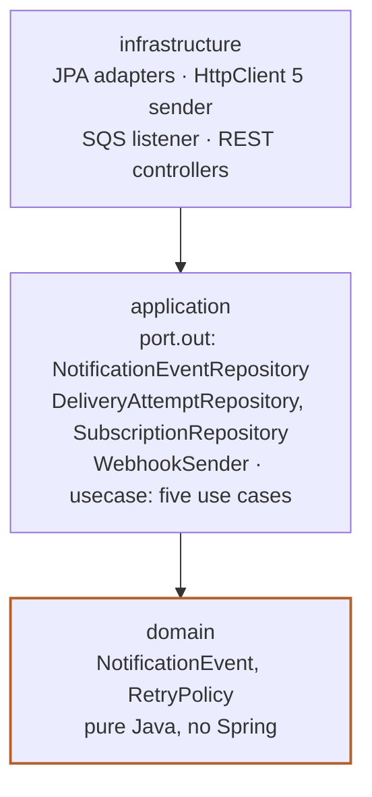

# notifications

One codebase, two processes: `notifications-api` answers self-service REST requests and
`notifications-worker` drains the queue and the delivery-attempts table. Both are the same Spring
Boot application (`infrastructure` module), started with a different `SPRING_PROFILES_ACTIVE`
(`api` or `worker`), plus `local` in the Docker Compose stack. See the root
[`README.md`](../../README.md#how-it-works) for how this fits the rest of the system.

## Modules

A Maven reactor of three modules, hexagonal architecture, arrows pointing inward:



| Module | Package | What it holds |
|---|---|---|
| [`domain`](domain) | `co.cobre.notifications.domain` | Entities, the delivery state machine, the retry policy, value objects. Pure Java, no framework dependency. |
| [`application`](application) | `co.cobre.notifications.application.port` (output ports), `.usecase` (the five use cases) | Depends only on `domain`. No inbound interfaces: adapters call use cases directly. |
| [`infrastructure`](infrastructure) | `co.cobre.notifications.infrastructure.{config,persistence,rest,security,webhook,worker}` | Spring Boot adapters. Produces `cobre/notifications`. |

Output ports implemented by an adapter: `NotificationEventRepository`, `DeliveryAttemptRepository`
and `SubscriptionRepository` by `infrastructure.persistence` (Spring Data JPA / PostgreSQL,
migrated with Flyway); `WebhookSender` by `infrastructure.webhook` (Apache HttpClient 5, HMAC-SHA256
signing, connect/read timeouts). Inbound entry points: `infrastructure.rest` (the self-service
controller), `infrastructure.worker.AccountEventListener` (the SQS listener, `@Profile("worker")`),
and `infrastructure.worker.DeliveryScheduler` (the `@Scheduled` claim loop).

ArchUnit (`infrastructure/src/test/java/co/cobre/notifications/architecture/HexagonalArchitectureTest.java`)
enforces this in CI: `domain` imports nothing from `application`/`infrastructure` or from Spring,
Jakarta, Jackson; `application` imports no `infrastructure`; every `@Entity` lives in
`infrastructure.persistence`; `infrastructure.rest` never depends on `infrastructure.persistence`;
`infrastructure.worker` and `infrastructure.rest`/`infrastructure.security` stay isolated from each
other, keeping the `api` and `worker` processes separate at compile time, not just by profile.

## Building and testing

```bash
./mvnw verify          # all three modules, with PMD, JaCoCo (100% line coverage) and ArchUnit
```

Spring profiles used at runtime: `api` (self-service REST, runs Flyway), `worker` (SQS listener and
delivery scheduler), `local` (WireMock as the webhook receiver, HTTP allowed for the allowlisted
host, short retry delays), `json` (ECS-formatted structured logging on the console, added on top of
`worker,local`).

## Configuration

Everything service-specific is under `notifications.*` in
[`infrastructure/src/main/resources/application.yaml`](infrastructure/src/main/resources/application.yaml),
overridden per profile in `application-api.yaml`, `application-worker.yaml`,
`application-local.yaml`, `application-json.yaml`:

| Key | Default (production) | What it controls |
|---|---|---|
| `notifications.worker.batch-size` / `.max-per-client` / `.lease` / `.poll-interval` | 50 / 10 / 16s / 1s | Claim batch size, per-client cap in memory, lease before a claimed attempt is reclaimable, scheduler tick |
| `notifications.webhook.connect-timeout` / `.read-timeout` | 3s / 5s | Apache HttpClient 5 timeouts for the outbound POST |
| `notifications.webhook.require-https` / `.allowlist` | `true` / empty | HTTPS enforcement and the plain-HTTP/private-IP host allowlist (`local` profile: `false` / `wiremock`) |
| `notifications.jwt.public-key` / `.audience` / `.client-claim` | RS256 public key path, `account-event-notification`, `sub` | JWT verification for the self-service API |
| `notifications.retry.base-delay` / `.factor` / `.max-delay` / `.jitter-ratio` / `.max-attempts` | 30s / 4 / 15m / 0.2 / 5 | Exponential backoff (`local`: 2s / 4 / 10s / 0.2 / 5) |
| `notifications.sqs.queue-name` | `account-events` | Queue the worker listens on |

The corresponding environment variables (`SQS_ENDPOINT`, `SQS_QUEUE_NAME`, `WEBHOOK_URL`,
`WEBHOOK_ALLOWLIST`, `JWT_PUBLIC_KEY_PATH`, `JWT_AUDIENCE`, `JWT_CLIENT_CLAIM`,
`SPRING_DATASOURCE_*`, `RETRY_BASE_DELAY`, `RETRY_MAX_DELAY`) are wired in
[`deploy/local/compose.yaml`](../../deploy/local/compose.yaml) from the repository root's `.env`.

## Endpoints and security

`GET /notification_events`, `GET /notification_events/{id}`,
`POST /notification_events/{id}/replay` — all Bearer-JWT protected (RS256, OAuth2 resource
server), `client_id` taken from the token's `sub` claim, never from a request parameter. Full
contract in [`../../docs/api/`](../../docs/api/).

## Metrics and logs

Prometheus metrics (`/actuator/prometheus`, exposition names): `notifications_registered_total`,
`notifications_skipped_total`, `notifications_duplicates_total`, `notifications_deliveries_total`
(tagged `status`, `client_id`), `notifications_webhook_latency_seconds`, `notifications_attempts_due`,
`notifications_batches_total`, `notifications_scheduler_errors_total`, and
`notifications_leases_expired_total` (defined in `DeliveryMetrics`, not yet emitted). Each delivery
attempt leaves a `webhook delivery attempt` log line in the worker with `event_id`, `client_id`,
`cycle`, `attempt_number`, `outcome`, `response_status` and `latency_ms`; enable the `json` profile
for ECS-formatted output. Details and Grafana panels:
[`../../deploy/local/README.md`](../../deploy/local/README.md#what-to-look-at-in-grafana).

## Further reading

[`../../docs/01-system-design.html`](../../docs/01-system-design.html) — the RFC: containers, the
hexagon, delivery sequence, data model, and the concurrency model behind the `SKIP LOCKED` claim.
